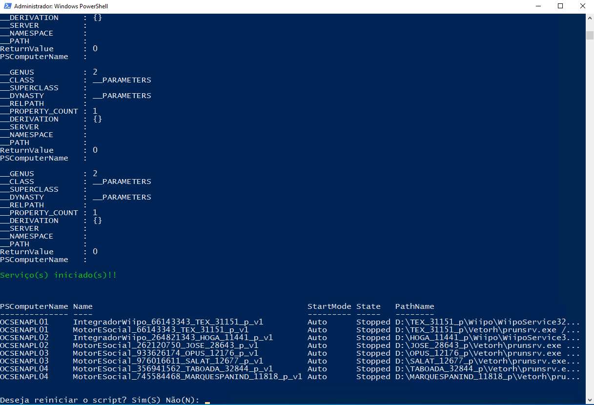

O objetivo deste script é garantir que serviços essenciais de produção estejam sempre em execução. Ele monitora constantemente os serviços AUTO que estão configurados para iniciar automaticamente, mas que por algum motivo estão parados. Além de identificá-los, ele os reinicia automaticamente.

<b>Funcionalidades principais</b>

Monitoramento Contínuo: O script é executado em loop infinito, verificando a cada ciclo o status dos serviços em múltiplos servidores de produção (OCSENAPL01, OCSENAPL02, etc.).

Filtro de Serviços: Ele busca especificamente por serviços cuja identificação contém "p" (indicando que são serviços de produção), estão parados (State -eq "Stopped") e configurados para inicialização automática (StartMode -eq "Auto").

Ação Automática: Ao detectar que um ou mais serviços pararam, o script inicia automaticamente os serviços, exibindo no console quais serviços foram reiniciados, incluindo o nome, estado, modo de inicialização e o caminho de execução.

Interatividade: Ao final de cada ciclo de verificação, o usuário tem a opção de reiniciar ou interromper o script, permitindo uma interação simples para acompanhar o monitoramento manualmente.

Exemplo de uso:
Este script é útil em cenários de TI onde a continuidade de serviços críticos é fundamental, automatizando a recuperação sem a necessidade de intervenção manual imediata, o que pode reduzir o tempo de inatividade.

```
while ($true) {
    Clear-Host

    Write-Host "Verificando serviços de produção que estão PARADOS e deveriam estar em execução..." -ForegroundColor Yellow

    # Verifica os serviços que são AUTO de PRODUÇÃO e estão parados
    $servicosParados = Get-WMIObject win32_service -ComputerName OCSENAPL01, OCSENAPL02, OCSENAPL03, OCSENAPL04, OCSENINT01, OCSENMDW01 |
        Where-Object {$_.PathName -like "*_p*" -and $_.State -eq "Stopped" -and $_.StartMode -eq "Auto"}

    if ($servicosParados) {
        Write-Host "Iniciando o(s) serviço(s) de PRODUÇÃO..." -ForegroundColor Yellow
        $servicosParados.StartService()
        Write-Host "Serviço(s) iniciado(s)!!" -ForegroundColor Green
        $servicosParados | Format-Table -AutoSize PSComputerName, Name, StartMode, State, PathName
    } else {
        Write-Host "Nenhum serviço AUTO de PRODUÇÃO está parado!!" -ForegroundColor Green
    }

    # Laço de repetição
    $restartScript = Read-Host -Prompt "Deseja reiniciar o script? Sim(S) Não(N)"
    if ($restartScript -ne "S") { break }
}

```

Essa solução otimiza a gestão de serviços e pode ser integrada em operações diárias para aumentar a resiliência da infraestrutura.
