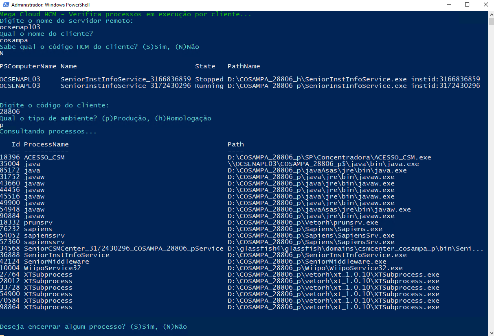

No cenário de administração de sistemas HCM, gerenciar processos remotamente é uma tarefa crítica para garantir o bom funcionamento dos ambientes dos clientes. Um dos desafios é monitorar e encerrar processos em execução de maneira eficiente, sem impactar negativamente a operação dos serviços.

Esse script PowerShell foi desenvolvido para realizar a verificação e encerramento de processos de maneira remota, permitindo interatividade com o operador, e garantindo que apenas os processos específicos de cada cliente sejam afetados.

<b>Funcionalidades do Script</b>

Interação com o Operador: O script solicita ao usuário informações importantes, como o nome do servidor remoto, o nome do cliente e o tipo de ambiente (produção ou homologação), tornando-o flexível para diferentes cenários.

Consulta de Processos Remotamente: Utilizando o comando Invoke-Command, o script consulta o servidor remoto para identificar processos em execução relacionados ao cliente. A lógica aplicada filtra os processos pelo caminho onde estão sendo executados, garantindo precisão na identificação.

Encerramento Seguro de Processos: Após listar os processos em execução, o operador pode optar por encerrar um ou mais processos. Isso é feito de maneira controlada, onde o ID do processo é fornecido pelo usuário e o encerramento é realizado remotamente usando o comando Stop-Process.

Laços de Repetição e Controle de Fluxo: O script é contínuo, permitindo ao operador realizar várias verificações e encerramentos sem precisar reiniciá-lo manualmente. Após cada ciclo, o operador pode escolher se deseja reiniciar o script ou encerrá-lo.

<b>Fluxo de Execução</b>

O usuário insere o nome do servidor remoto e do cliente.
O script consulta se há processos em execução para o cliente no servidor remoto.
Se processos forem encontrados, eles são listados para o operador.
O operador pode optar por encerrar processos individualmente, fornecendo o ID do processo.
O script pergunta se o operador deseja continuar ou encerrar mais processos.

<b>Benefícios</b>

Automação e Eficiência: Reduz a necessidade de intervenções manuais e automatiza a busca por processos relacionados ao cliente.
Flexibilidade: Pode ser adaptado para diferentes ambientes (produção ou homologação) e diferentes clientes de forma rápida.
Interação Amigável: A interface com o operador é simples e clara, facilitando o uso para administradores de sistemas.
Esse script oferece uma solução poderosa e automatizada para a gestão de processos remotos em ambientes HCM, contribuindo para a estabilidade e eficiência dos serviços prestados.

<b>Segue o código completo:</b>
```
While ($true) {

    Clear-Host;
    Write-Host "Mega Cloud HCM - Verifica processos em execução por cliente..." -ForegroundColor Green

    Write-Host "Digite o nome do servidor remoto:" -ForegroundColor Cyan
    $computerName = Read-Host

    # DEFINIÇÃO DO CLIENTE
    Write-Host "Qual o nome do cliente?" -ForegroundColor Cyan
    $nomeCli = Read-Host

    Write-Host "Sabe qual o código HCM do cliente? (S)Sim, (N)Não" -ForegroundColor Cyan
    $codCliQ = Read-Host;

    if ($codCliQ -eq "N") {
        # Caso o código do cliente não seja conhecido
        Invoke-Command -ComputerName $computerName -ScriptBlock {
            param($nomeCli)
            Get-WMIObject win32_service | Where-Object { $_.pathname -like "*$nomeCli*" -and $_.name -like "*SeniorInstInfoService*" } | Format-Table -AutoSize PSComputerName, Name, State, PathName
        } -ArgumentList $nomeCli

        Write-Host "Digite o código do cliente:" -ForegroundColor Cyan
        $codCli = Read-Host
    } else {
        Write-Host "Confirme o código..." -ForegroundColor Cyan
        $codCli = Read-Host
    }

    Write-Host "Qual o tipo de ambiente? (p)Produção, (h)Homologação" -ForegroundColor Cyan
    $tipAmb = Read-Host
    $cliente = "$nomeCli" + "_" + "$codCli" + "_" + "$tipAmb"

    Write-Host "Consultando processos..." -ForegroundColor Cyan
    
$nenhumProcesso = $false

# CONSULTA OS PROCESSOS EM EXECUÇÃO
Invoke-Command -ComputerName $computerName -ScriptBlock {
    param($cliente)

    # Armazena os processos em uma variável
    $processos = Get-Process -Name * | Where-Object { $_.path -like "*$cliente*" }

    # Verifica se a lista de processos está vazia
    if ($processos) {
        # Se houver processos, exibe-os em formato de tabela
        $processos | Format-Table -AutoSize ID, ProcessName, Path
    } else {
        # Caso contrário, exibe a mensagem e define uma flag para pular o encerramento
        Write-Host "Nenhum processo encontrado para o cliente $cliente" -ForegroundColor Yellow
        return $true
    }

} -ArgumentList $cliente -OutVariable resultado

    $nenhumProcesso = $resultado

# Verifica se nenhum processo foi encontrado
if ($nenhumProcesso -eq $true) {
    # Pula o encerramento e vai direto para o laço de repetição
    Write-Host "Deseja reiniciar o script? Sim(S) Não(N)" -ForegroundColor Cyan
    $restartScript = Read-Host
    if ($restartScript -eq "S") {
        continue
    } else {
        break
    }
}

# Se processos foram encontrados, continua o fluxo para encerrar processos
Write-Host "Deseja encerrar algum processo? (S)Sim, (N)Não" -ForegroundColor Cyan
$processo = Read-Host

if ($processo -eq "S") {
    do {
        Write-Host "Digite o ID do processo que você deseja encerrar" -ForegroundColor Cyan
        $comando = Read-Host

        # ENCERRA O PROCESSO DESEJADO
        Invoke-Command -ComputerName $computerName -ScriptBlock {
            param($comando)
            Get-Process | Where-Object { $_.id -eq $comando } | Stop-Process -Force
        } -ArgumentList $comando

        Write-Host "Processo encerrado com sucesso!!" -ForegroundColor Cyan

        # Exibe os processos restantes
        Invoke-Command -ComputerName $computerName -ScriptBlock {
            param($cliente)
            Get-Process -Name * | Where-Object { $_.path -like "*$cliente*" } | Format-Table -AutoSize ID, ProcessName, Path
        } -ArgumentList $cliente

        # Pergunta se deseja encerrar mais algum processo
        Write-Host "Deseja encerrar mais algum processo? (S)Sim, (N)Não" -ForegroundColor Cyan
        $maisProcessos = Read-Host

    } while ($maisProcessos -eq "S")
}

# LACO DE REPETIÇÃO
Write-Host "Deseja reiniciar o script? Sim(S) Não(N)" -ForegroundColor Cyan
$restartScript = Read-Host
if ($restartScript -eq "S") {
    continue
} else {
    break
}

}

Exit

```

A automação com PowerShell é uma excelente ferramenta para garantir o controle e monitoramento de processos em ambientes corporativos, proporcionando mais segurança e eficiência ao time de TI.
