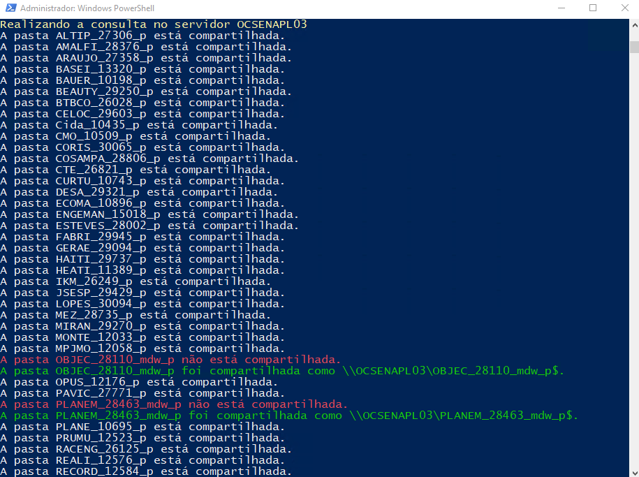

No meu recente projeto, desenvolvi um script PowerShell robusto para gerenciar compartilhamentos de pasta em múltiplos servidores de produção, visando otimizar a administração e assegurar que as pastas importantes estivessem devidamente compartilhadas.

Objetivo: Garantir que todas as pastas de produção em servidores específicos estejam compartilhadas de forma adequada e que os compartilhamentos não existentes sejam criados conforme necessário.

<b>O que o script faz</b>

Consulta e Filtragem:
O script conecta-se a servidores remotos (OCSENAPLH01, OCSENAPL01, OCSENAPL02, OCSENAPL03 e OCSENAPL04) e obtém uma lista de pastas no caminho D:\ que atendem a critérios específicos (nomes contendo _p e excluindo termos como OLD e Teste).

Verificação de Compartilhamentos:
Para cada pasta, verifica se já existe um compartilhamento correspondente.
Se não houver um compartilhamento existente, o script cria um novo compartilhamento.

Configuração de Permissões:
O script coleta as permissões atuais de cada pasta e classifica os grupos de usuários (RH, HCM, Compliance, Sapiens) conforme as regras definidas.
Mantém as permissões NTFS existentes enquanto cria novos compartilhamentos com as permissões necessárias.

Interface e Repetição:
Após a execução em todos os servidores, o script oferece a opção de reiniciar a execução, permitindo a administração contínua conforme necessário.

Exemplo de sáida:
```
Realizando a consulta no servidor OCSENAPL01
A pasta Project_X está compartilhada.
A pasta TestFolder não está compartilhada.
A pasta TestFolder foi compartilhada como \\OCSENAPL01\TestFolder$.

```

Benefícios:
Automatização: Redução do trabalho manual e erros humanos ao garantir que todas as pastas necessárias sejam compartilhadas corretamente.
Eficiência: A capacidade de gerenciar múltiplos servidores de forma simultânea e consistente.
Flexibilidade: Facilidade para ajustar critérios de filtragem e grupos de permissões conforme necessidades futuras.
Este script é um exemplo prático da aplicação de PowerShell para administrar e automatizar tarefas administrativas complexas, melhorando a eficiência e a precisão no ambiente de produção.

Segue o código completo:
```
while ($true) {
Clear-Host
Write-Host "Script para consultar e corrigir os compartilhamentos de PRODUÇÃO do HCM" -ForegroundColor Green

# Define o nome do servidor remoto
$nomeServidor = "OCSENAPLH01"

Write-Host "Realizando a consulta no servidor OCSENAPLH01" -ForegroundColor Yellow

# Obtém a lista de pastas que atendem aos critérios
$listaPastas = Invoke-Command -ComputerName $nomeServidor -ScriptBlock {
    Get-ChildItem -Path D:\* -Directory | Where-Object {
        $_.Name -like "*_p*" -and $_.Name -notlike "*OLD*" -and $_.Name -notlike "*Teste*"
    }
}

# Obtém todos os compartilhamentos do servidor remoto 
$compartilhamentos = Get-WmiObject -ComputerName $nomeServidor -Class Win32_Share | Where-Object {
    $_.Path -like "D:\*" -and $_.Name -notlike "\\OCSEN*" -and $_.Name -notlike "*_h*" -and $_.Name -notlike "D$" -and $_.Name -notlike "*csmcenter*" -and $_.Name -notlike "*config*"
}

# Itera sobre cada pasta encontrada
foreach ($pasta in $listaPastas) {
    $pastaCompartilhada = $false

    # Compara com cada compartilhamento
    foreach ($compartilhamento in $compartilhamentos) {
        if ($pasta.FullName -eq $compartilhamento.Path) {
            $pastaCompartilhada = $true
            break
        }
    }

    # Verifica se a pasta está compartilhada e compartilha se necessário
    if ($pastaCompartilhada) {
        Write-Host "A pasta $($pasta.Name) está compartilhada."
    } else {
        Write-Host "A pasta $($pasta.Name) não está compartilhada." -ForegroundColor Red
        
        # Define o nome do compartilhamento
        $nomeCompartilhamento = $pasta.Name + "$"

        # Obtém a lista de grupos diferentes para compartilhar
        $gruposFull = @("MEGACLOUD\CloudOps", "MEGACLOUD\HCM MANAGER")

        # Obtém a ACL da pasta e filtra os grupos apropriados
        $acl = Invoke-Command -ComputerName $nomeServidor -ScriptBlock {
            param ($pasta)
            $acl = Get-Acl -Path $pasta.FullName
            $filteredGroups = $acl.Access | Where-Object { $_.IdentityReference -match "_HCM_" -or $_.IdentityReference -match "_RH_" -or $_.IdentityReference -match "_COMPLIANCE_" -or $_.IdentityReference -match "_SAPIENS_"} | Select-Object -ExpandProperty IdentityReference
            return $filteredGroups
        } -ArgumentList $pasta

        # Inicializa os arrays de grupos
        $grupoRH = @()
        $grupoHCM = @()
        $grupoCompliance = @()
        $grupoSapiens = @()

        # Classifica os grupos de acordo com o tipo
        foreach ($group in $acl) {
            if ($group -match "_RH_") {
                $grupoRH += $group -replace '.*\\(.*?)$', '$1'
            } elseif ($group -match "_HCM_") {
                $grupoHCM += $group -replace '.*\\(.*?)$', '$1'
            } elseif ($group -match "_COMPLIANCE_") {
                $grupoCompliance += $group -replace '.*\\(.*?)$', '$1'
            } elseif ($group -match "_SAPIENS_") {
                $grupoSapiens += $group -replace '.*\\(.*?)$', '$1'
            }
        }

        # Junta os grupos em um único array para ChangeAccess
        $grupoChangeAccess = @("MEGACLOUD\Resolvedores Cloud") + $grupoRH + $grupoHCM + $grupoCompliance + $grupoSapiens

        # Compartilha a pasta sem alterar permissões NTFS
        Invoke-Command -ComputerName $nomeServidor -ScriptBlock {
            param ($nomeCompartilhamento, $caminhoPasta, $gruposFull, $grupoChangeAccess)

            # Cria o compartilhamento mantendo as permissões NTFS existentes
            New-SmbShare -Name $nomeCompartilhamento -Path $caminhoPasta -FullAccess $gruposFull -ChangeAccess $grupoChangeAccess | Out-Null
        } -ArgumentList $nomeCompartilhamento, $pasta.FullName, $gruposFull, $grupoChangeAccess
        
        Write-Host "A pasta $($pasta.Name) foi compartilhada como \\$nomeServidor\$nomeCompartilhamento." -ForegroundColor Green
    }
}

# Define o nome do servidor remoto
$nomeServidor = "OCSENAPL01"

Write-Host "Realizando a consulta no servidor OCSENAPL01" -ForegroundColor Yellow

# Obtém a lista de pastas que atendem aos critérios
$listaPastas = Invoke-Command -ComputerName $nomeServidor -ScriptBlock {
    Get-ChildItem -Path D:\* -Directory | Where-Object {
        $_.Name -like "*_p*" -and $_.Name -notlike "*OLD*" -and $_.Name -notlike "*Teste*"
    }
}

# Obtém todos os compartilhamentos do servidor remoto 
$compartilhamentos = Get-WmiObject -ComputerName $nomeServidor -Class Win32_Share | Where-Object {
    $_.Path -like "D:\*" -and $_.Name -notlike "\\OCSEN*" -and $_.Name -notlike "*_h*" -and $_.Name -notlike "D$" -and $_.Name -notlike "*csmcenter*" -and $_.Name -notlike "*config*"
}

# Itera sobre cada pasta encontrada
foreach ($pasta in $listaPastas) {
    $pastaCompartilhada = $false

    # Compara com cada compartilhamento
    foreach ($compartilhamento in $compartilhamentos) {
        if ($pasta.FullName -eq $compartilhamento.Path) {
            $pastaCompartilhada = $true
            break
        }
    }

    # Verifica se a pasta está compartilhada e compartilha se necessário
    if ($pastaCompartilhada) {
        Write-Host "A pasta $($pasta.Name) está compartilhada."
    } else {
        Write-Host "A pasta $($pasta.Name) não está compartilhada." -ForegroundColor Red
        
        # Define o nome do compartilhamento
        $nomeCompartilhamento = $pasta.Name + "$"

        # Obtém a lista de grupos diferentes para compartilhar
        $gruposFull = @("MEGACLOUD\CloudOps", "MEGACLOUD\HCM MANAGER")

        # Obtém a ACL da pasta e filtra os grupos apropriados
        $acl = Invoke-Command -ComputerName $nomeServidor -ScriptBlock {
            param ($pasta)
            $acl = Get-Acl -Path $pasta.FullName
            $filteredGroups = $acl.Access | Where-Object { $_.IdentityReference -match "_HCM_" -or $_.IdentityReference -match "_RH_" -or $_.IdentityReference -match "_COMPLIANCE_" -or $_.IdentityReference -match "_SAPIENS_"} | Select-Object -ExpandProperty IdentityReference
            return $filteredGroups
        } -ArgumentList $pasta

        # Inicializa os arrays de grupos
        $grupoRH = @()
        $grupoHCM = @()
        $grupoCompliance = @()
        $grupoSapiens = @()

        # Classifica os grupos de acordo com o tipo
        foreach ($group in $acl) {
            if ($group -match "_RH_") {
                $grupoRH += $group -replace '.*\\(.*?)$', '$1'
            } elseif ($group -match "_HCM_") {
                $grupoHCM += $group -replace '.*\\(.*?)$', '$1'
            } elseif ($group -match "_COMPLIANCE_") {
                $grupoCompliance += $group -replace '.*\\(.*?)$', '$1'
            } elseif ($group -match "_SAPIENS_") {
                $grupoSapiens += $group -replace '.*\\(.*?)$', '$1'
            }
        }

        # Junta os grupos em um único array para ChangeAccess
        $grupoChangeAccess = @("MEGACLOUD\Resolvedores Cloud") + $grupoRH + $grupoHCM + $grupoCompliance + $grupoSapiens

        # Compartilha a pasta sem alterar permissões NTFS
        Invoke-Command -ComputerName $nomeServidor -ScriptBlock {
            param ($nomeCompartilhamento, $caminhoPasta, $gruposFull, $grupoChangeAccess)

            # Cria o compartilhamento mantendo as permissões NTFS existentes
            New-SmbShare -Name $nomeCompartilhamento -Path $caminhoPasta -FullAccess $gruposFull -ChangeAccess $grupoChangeAccess | Out-Null
        } -ArgumentList $nomeCompartilhamento, $pasta.FullName, $gruposFull, $grupoChangeAccess
        
        Write-Host "A pasta $($pasta.Name) foi compartilhada como \\$nomeServidor\$nomeCompartilhamento." -ForegroundColor Green
    }
}

# Define o nome do servidor remoto
$nomeServidor = "OCSENAPL02"

Write-Host "Realizando a consulta no servidor OCSENAPL02" -ForegroundColor Yellow

# Obtém a lista de pastas que atendem aos critérios
$listaPastas = Invoke-Command -ComputerName $nomeServidor -ScriptBlock {
    Get-ChildItem -Path D:\* -Directory | Where-Object {
        $_.Name -like "*_p*" -and $_.Name -notlike "*OLD*" -and $_.Name -notlike "*Teste*"
    }
}

# Obtém todos os compartilhamentos do servidor remoto 
$compartilhamentos = Get-WmiObject -ComputerName $nomeServidor -Class Win32_Share | Where-Object {
    $_.Path -like "D:\*" -and $_.Name -notlike "\\OCSEN*" -and $_.Name -notlike "*_h*" -and $_.Name -notlike "D$" -and $_.Name -notlike "*csmcenter*" -and $_.Name -notlike "*config*"
}

# Itera sobre cada pasta encontrada
foreach ($pasta in $listaPastas) {
    $pastaCompartilhada = $false

    # Compara com cada compartilhamento
    foreach ($compartilhamento in $compartilhamentos) {
        if ($pasta.FullName -eq $compartilhamento.Path) {
            $pastaCompartilhada = $true
            break
        }
    }

    # Verifica se a pasta está compartilhada e compartilha se necessário
    if ($pastaCompartilhada) {
        Write-Host "A pasta $($pasta.Name) está compartilhada."
    } else {
        Write-Host "A pasta $($pasta.Name) não está compartilhada." -ForegroundColor Red
        
        # Define o nome do compartilhamento
        $nomeCompartilhamento = $pasta.Name + "$"

        # Obtém a lista de grupos diferentes para compartilhar
        $gruposFull = @("MEGACLOUD\CloudOps", "MEGACLOUD\HCM MANAGER")

        # Obtém a ACL da pasta e filtra os grupos apropriados
        $acl = Invoke-Command -ComputerName $nomeServidor -ScriptBlock {
            param ($pasta)
            $acl = Get-Acl -Path $pasta.FullName
            $filteredGroups = $acl.Access | Where-Object { $_.IdentityReference -match "_HCM_" -or $_.IdentityReference -match "_RH_" -or $_.IdentityReference -match "_COMPLIANCE_" -or $_.IdentityReference -match "_SAPIENS_"} | Select-Object -ExpandProperty IdentityReference
            return $filteredGroups
        } -ArgumentList $pasta

        # Inicializa os arrays de grupos
        $grupoRH = @()
        $grupoHCM = @()
        $grupoCompliance = @()
        $grupoSapiens = @()

        # Classifica os grupos de acordo com o tipo
        foreach ($group in $acl) {
            if ($group -match "_RH_") {
                $grupoRH += $group -replace '.*\\(.*?)$', '$1'
            } elseif ($group -match "_HCM_") {
                $grupoHCM += $group -replace '.*\\(.*?)$', '$1'
            } elseif ($group -match "_COMPLIANCE_") {
                $grupoCompliance += $group -replace '.*\\(.*?)$', '$1'
            } elseif ($group -match "_SAPIENS_") {
                $grupoSapiens += $group -replace '.*\\(.*?)$', '$1'
            }
        }

        # Junta os grupos em um único array para ChangeAccess
        $grupoChangeAccess = @("MEGACLOUD\Resolvedores Cloud") + $grupoRH + $grupoHCM + $grupoCompliance + $grupoSapiens

        # Compartilha a pasta sem alterar permissões NTFS
        Invoke-Command -ComputerName $nomeServidor -ScriptBlock {
            param ($nomeCompartilhamento, $caminhoPasta, $gruposFull, $grupoChangeAccess)

            # Cria o compartilhamento mantendo as permissões NTFS existentes
            New-SmbShare -Name $nomeCompartilhamento -Path $caminhoPasta -FullAccess $gruposFull -ChangeAccess $grupoChangeAccess | Out-Null
        } -ArgumentList $nomeCompartilhamento, $pasta.FullName, $gruposFull, $grupoChangeAccess
        
        Write-Host "A pasta $($pasta.Name) foi compartilhada como \\$nomeServidor\$nomeCompartilhamento." -ForegroundColor Green
    }
}

# Define o nome do servidor remoto
$nomeServidor = "OCSENAPL03"

Write-Host "Realizando a consulta no servidor OCSENAPL03" -ForegroundColor Yellow

# Obtém a lista de pastas que atendem aos critérios
$listaPastas = Invoke-Command -ComputerName $nomeServidor -ScriptBlock {
    Get-ChildItem -Path D:\* -Directory | Where-Object {
        $_.Name -like "*_p*" -and $_.Name -notlike "*OLD*" -and $_.Name -notlike "*Teste*"
    }
}

# Obtém todos os compartilhamentos do servidor remoto 
$compartilhamentos = Get-WmiObject -ComputerName $nomeServidor -Class Win32_Share | Where-Object {
    $_.Path -like "D:\*" -and $_.Name -notlike "\\OCSEN*" -and $_.Name -notlike "*_h*" -and $_.Name -notlike "D$" -and $_.Name -notlike "*csmcenter*" -and $_.Name -notlike "*config*"
}

# Itera sobre cada pasta encontrada
foreach ($pasta in $listaPastas) {
    $pastaCompartilhada = $false

    # Compara com cada compartilhamento
    foreach ($compartilhamento in $compartilhamentos) {
        if ($pasta.FullName -eq $compartilhamento.Path) {
            $pastaCompartilhada = $true
            break
        }
    }

    # Verifica se a pasta está compartilhada e compartilha se necessário
    if ($pastaCompartilhada) {
        Write-Host "A pasta $($pasta.Name) está compartilhada."
    } else {
        Write-Host "A pasta $($pasta.Name) não está compartilhada." -ForegroundColor Red
        
        # Define o nome do compartilhamento
        $nomeCompartilhamento = $pasta.Name + "$"

        # Obtém a lista de grupos diferentes para compartilhar
        $gruposFull = @("MEGACLOUD\CloudOps", "MEGACLOUD\HCM MANAGER")

        # Obtém a ACL da pasta e filtra os grupos apropriados
        $acl = Invoke-Command -ComputerName $nomeServidor -ScriptBlock {
            param ($pasta)
            $acl = Get-Acl -Path $pasta.FullName
            $filteredGroups = $acl.Access | Where-Object { $_.IdentityReference -match "_HCM_" -or $_.IdentityReference -match "_RH_" -or $_.IdentityReference -match "_COMPLIANCE_" -or $_.IdentityReference -match "_SAPIENS_"} | Select-Object -ExpandProperty IdentityReference
            return $filteredGroups
        } -ArgumentList $pasta

        # Inicializa os arrays de grupos
        $grupoRH = @()
        $grupoHCM = @()
        $grupoCompliance = @()
        $grupoSapiens = @()

        # Classifica os grupos de acordo com o tipo
        foreach ($group in $acl) {
            if ($group -match "_RH_") {
                $grupoRH += $group -replace '.*\\(.*?)$', '$1'
            } elseif ($group -match "_HCM_") {
                $grupoHCM += $group -replace '.*\\(.*?)$', '$1'
            } elseif ($group -match "_COMPLIANCE_") {
                $grupoCompliance += $group -replace '.*\\(.*?)$', '$1'
            } elseif ($group -match "_SAPIENS_") {
                $grupoSapiens += $group -replace '.*\\(.*?)$', '$1'
            }
        }

        # Junta os grupos em um único array para ChangeAccess
        $grupoChangeAccess = @("MEGACLOUD\Resolvedores Cloud") + $grupoRH + $grupoHCM + $grupoCompliance + $grupoSapiens

        # Compartilha a pasta sem alterar permissões NTFS
        Invoke-Command -ComputerName $nomeServidor -ScriptBlock {
            param ($nomeCompartilhamento, $caminhoPasta, $gruposFull, $grupoChangeAccess)

            # Cria o compartilhamento mantendo as permissões NTFS existentes
            New-SmbShare -Name $nomeCompartilhamento -Path $caminhoPasta -FullAccess $gruposFull -ChangeAccess $grupoChangeAccess | Out-Null
        } -ArgumentList $nomeCompartilhamento, $pasta.FullName, $gruposFull, $grupoChangeAccess
        
        Write-Host "A pasta $($pasta.Name) foi compartilhada como \\$nomeServidor\$nomeCompartilhamento." -ForegroundColor Green
    }
}

# Define o nome do servidor remoto
$nomeServidor = "OCSENAPL04"

Write-Host "Realizando a consulta no servidor OCSENAPL04" -ForegroundColor Yellow

# Obtém a lista de pastas que atendem aos critérios
$listaPastas = Invoke-Command -ComputerName $nomeServidor -ScriptBlock {
    Get-ChildItem -Path D:\* -Directory | Where-Object {
        $_.Name -like "*_p*" -and $_.Name -notlike "*OLD*" -and $_.Name -notlike "*Teste*"
    }
}

# Obtém todos os compartilhamentos do servidor remoto 
$compartilhamentos = Get-WmiObject -ComputerName $nomeServidor -Class Win32_Share | Where-Object {
    $_.Path -like "D:\*" -and $_.Name -notlike "\\OCSEN*" -and $_.Name -notlike "*_h*" -and $_.Name -notlike "D$" -and $_.Name -notlike "*csmcenter*" -and $_.Name -notlike "*config*"
}

# Itera sobre cada pasta encontrada
foreach ($pasta in $listaPastas) {
    $pastaCompartilhada = $false

    # Compara com cada compartilhamento
    foreach ($compartilhamento in $compartilhamentos) {
        if ($pasta.FullName -eq $compartilhamento.Path) {
            $pastaCompartilhada = $true
            break
        }
    }

    # Verifica se a pasta está compartilhada e compartilha se necessário
    if ($pastaCompartilhada) {
        Write-Host "A pasta $($pasta.Name) está compartilhada."
    } else {
        Write-Host "A pasta $($pasta.Name) não está compartilhada." -ForegroundColor Red
        
        # Define o nome do compartilhamento
        $nomeCompartilhamento = $pasta.Name + "$"

        # Obtém a lista de grupos diferentes para compartilhar
        $gruposFull = @("MEGACLOUD\CloudOps", "MEGACLOUD\HCM MANAGER")

        # Obtém a ACL da pasta e filtra os grupos apropriados
        $acl = Invoke-Command -ComputerName $nomeServidor -ScriptBlock {
            param ($pasta)
            $acl = Get-Acl -Path $pasta.FullName
            $filteredGroups = $acl.Access | Where-Object { $_.IdentityReference -match "_HCM_" -or $_.IdentityReference -match "_RH_" -or $_.IdentityReference -match "_COMPLIANCE_" -or $_.IdentityReference -match "_SAPIENS_"} | Select-Object -ExpandProperty IdentityReference
            return $filteredGroups
        } -ArgumentList $pasta

        # Inicializa os arrays de grupos
        $grupoRH = @()
        $grupoHCM = @()
        $grupoCompliance = @()
        $grupoSapiens = @()

        # Classifica os grupos de acordo com o tipo
        foreach ($group in $acl) {
            if ($group -match "_RH_") {
                $grupoRH += $group -replace '.*\\(.*?)$', '$1'
            } elseif ($group -match "_HCM_") {
                $grupoHCM += $group -replace '.*\\(.*?)$', '$1'
            } elseif ($group -match "_COMPLIANCE_") {
                $grupoCompliance += $group -replace '.*\\(.*?)$', '$1'
            } elseif ($group -match "_SAPIENS_") {
                $grupoSapiens += $group -replace '.*\\(.*?)$', '$1'
            }
        }

        # Junta os grupos em um único array para ChangeAccess
        $grupoChangeAccess = @("MEGACLOUD\Resolvedores Cloud") + $grupoRH + $grupoHCM + $grupoCompliance + $grupoSapiens

        # Compartilha a pasta sem alterar permissões NTFS
        Invoke-Command -ComputerName $nomeServidor -ScriptBlock {
            param ($nomeCompartilhamento, $caminhoPasta, $gruposFull, $grupoChangeAccess)

            # Cria o compartilhamento mantendo as permissões NTFS existentes
            New-SmbShare -Name $nomeCompartilhamento -Path $caminhoPasta -FullAccess $gruposFull -ChangeAccess $grupoChangeAccess | Out-Null
        } -ArgumentList $nomeCompartilhamento, $pasta.FullName, $gruposFull, $grupoChangeAccess
        
        Write-Host "A pasta $($pasta.Name) foi compartilhada como \\$nomeServidor\$nomeCompartilhamento." -ForegroundColor Green
    }
}

    # Laço de repetição
    $restartScript = Read-Host -Prompt "Deseja reiniciar o script? Sim(S) Não(N)"
    if ($restartScript -ne "S") {
        break
    }
}

```
