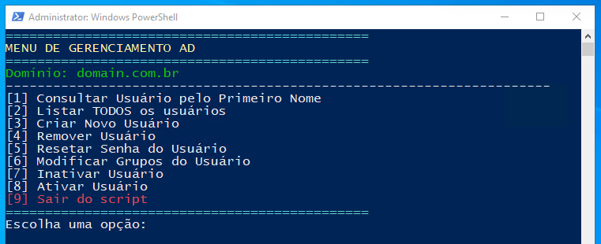

<b>🚀 Automatizando a Gestão de Usuários no Active Directory com PowerShell 💻</b>  
Gerenciar usuários no Active Directory (AD) pode ser uma tarefa repetitiva e propensa a erros quando feita manualmente. Pensando nisso, desenvolvi um script em <b>PowerShell</b> para simplificar e automatizar as operações mais comuns no AD, garantindo eficiência e padronização no gerenciamento.

🎯 <b>Funcionalidades do Script:</b>  
✅ <b>Verificação de Permissões:</b>  
- O script verifica se está sendo executado com privilégios de administrador.  
- Se não estiver, reinicia automaticamente com as permissões necessárias.  

📂 <b>Integração com o Active Directory:</b>  
- Verifica se o módulo Active Directory está instalado antes de continuar.  
- Conecta ao domínio especificado.  

🛠️ <b>Operações Disponíveis:</b>  
<b>Consultar Usuário pelo Primeiro Nome:</b>  
- Pesquisa usuários pelo primeiro nome e exibe informações como nome completo, login, e-mail, status (ativo/inativo) e grupos pertencentes.  

<b>Listar Todos os Usuários:</b>  
- Exibe todos os usuários do AD, filtrando contas padrão como administrator e guest.  

<b>Criar Novo Usuário:</b>  
- Cria um novo usuário no AD com informações personalizadas.  
- Define senha, cargo, e adiciona aos grupos especificados.  

<b>Remover Usuário:</b>  
- Exclui um usuário do AD de forma segura.  

<b>Resetar Senha do Usuário:</b>  
- Permite redefinir a senha de um usuário.  
- Oferece opções para exigir a troca de senha no próximo login e para definir se a senha nunca expira.  

<b>Modificar Grupos do Usuário:</b>  
- Adiciona ou remove usuários de grupos no AD.  

<b>Ativar/Inativar Usuário:</b>  
- Ativa ou desativa contas de usuário de forma rápida.  

📋 <b>Interface Simples e Intuitiva:</b>  
- Menu interativo que guia o administrador pelas opções.  
- Feedback visual para cada ação realizada.  

⚡ <b>Destaques Técnicos:</b>  
Segurança: Uso de SecureString para manipulação de senhas.  
Eficiência: Automação de tarefas críticas reduzindo erros humanos.  
Flexibilidade: Possibilidade de personalizar o script para diferentes domínios e estruturas de AD.  

💡 <b>Por que usar este script?</b>  
Economia de Tempo: Automatiza tarefas manuais recorrentes.  
Consistência: Garante que todas as operações sigam o mesmo padrão.  
Segurança: Minimiza riscos relacionados à manipulação manual de contas.  
Se você lida com ambientes que utilizam o Active Directory, esse script pode ser um grande aliado na sua rotina! ⚙️🔐  
💬 Gostou? Tem sugestões ou dúvidas? Entre em contato comigo! 👇  
📲💬 +55 16 99158-4347

Clique [aqui](https://github.com/igordriguess/PowerShell/blob/main/ManipulaAD.ps1) para ter acesso o código completo, aproveite e bom uso!!!
