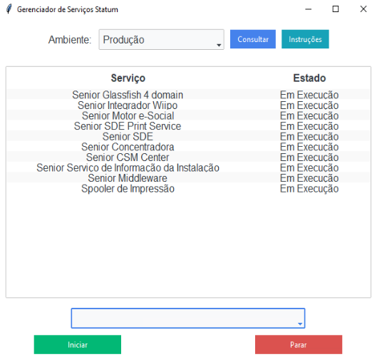

Este projeto consiste em uma interface gráfica (GUI) desenvolvida em Python, utilizando a biblioteca Tkinter, para manipulação remota de serviços em ambientes de Produção e Homologação de uma infraestrutura HCM SaaS da Senior. A ferramenta permite consultar, iniciar e parar serviços associados a um cliente específico, simplificando o gerenciamento de serviços em múltiplos servidores.

<b>Funcionalidades</b>

Consulta de Serviços Remotos: A aplicação realiza consultas remotas para verificar o status de serviços utilizando comandos PowerShell através da função subprocess, apresentando os resultados em uma tabela interativa.

Ambientes Diferenciados: O usuário pode selecionar se deseja realizar a operação no ambiente de Produção ou Homologação, garantindo maior controle sobre os ambientes.

Filtragem de Serviços: A interface possui um sistema de filtragem onde os nomes reais dos serviços são mascarados com nomes descritivos. Por exemplo, um serviço identificado como "seniorinst" é apresentado ao usuário como "Senior Serviço de Informação da Instalação", facilitando a identificação.

Manipulação de Serviços: O usuário pode selecionar serviços específicos ou optar por manipular todos os serviços de uma vez. A partir desta seleção, ele pode iniciar ou parar os serviços diretamente da interface.

<b>Tecnologias utilizadas</b>

Python 3: Linguagem principal usada no projeto.
Tkinter: Biblioteca nativa do Python para criação de interfaces gráficas.
subprocess: Módulo utilizado para execução de comandos PowerShell remotamente.
PowerShell: Linguagem de script para realizar consultas e operações nos servidores remotos.
Interface do Usuário:
Botões de Controle: O usuário pode consultar, iniciar ou parar serviços através de botões intuitivos.
Tabela Dinâmica: A tabela apresenta os resultados das consultas de serviços, mostrando o nome do serviço (mascarado) e o estado atual (Em Execução ou Parado).
Combobox Interativa: Um campo de seleção permite ao usuário escolher o serviço específico ou todos os serviços para realizar a operação desejada.
Lógica do Script:
Consulta de Serviços: Através do botão "Consultar Serviços", a aplicação coleta os serviços ativos no servidor remoto, aplicando filtros pelo cliente e ambiente selecionados. O comando PowerShell é executado remotamente, e os resultados são mostrados na tabela.

Iniciar/Parar Serviços: O usuário pode iniciar ou parar serviços individualmente ou em massa. Para isso, ele escolhe o serviço desejado no combobox e clica em "Iniciar Serviço(s)" ou "Parar Serviço(s)", acionando o comando PowerShell que realiza a ação no servidor remoto.

<b>Exemplo de uso</b>

O administrador deseja verificar se todos os serviços de um cliente específico estão em execução no ambiente de Produção ou Homologação. Ele seleciona o ambiente "Produção", consulta os serviços e vê o status na tabela. Se algum serviço estiver parado, ele pode iniciá-lo diretamente da interface.

Clique [aqui](https://github.com/igordriguess/ManipulaServicesCloud/blob/main/ManipulaServicesCloud.py) para visualizar o código completo.
