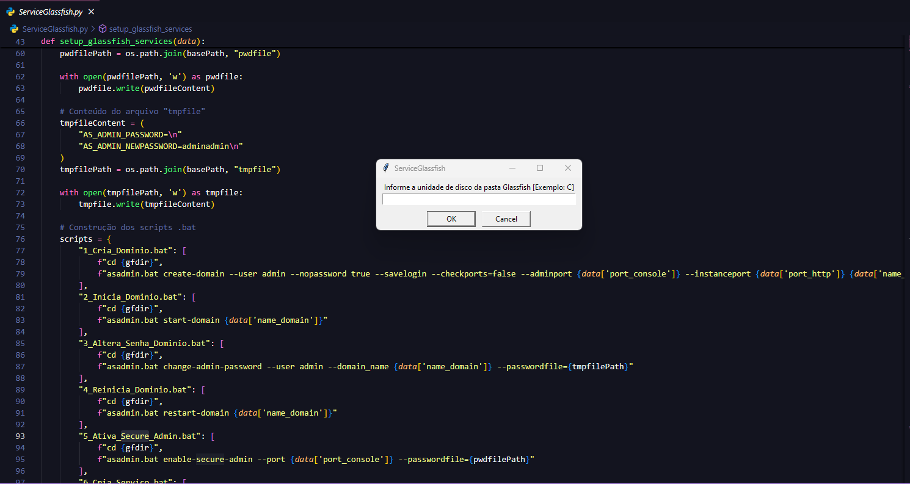

Neste projeto, vou explicar a lógica por trás de um script Python que automatiza a configuração e criação de serviços do Glassfish. O script utiliza bibliotecas como tkinter para entrada de dados, subprocess para execução de comandos e OS para manipulação de arquivos e diretórios. Abaixo está uma visão geral das funcionalidades do script.

<b>1. Entrada de Dados via Tkinter</b> <br/>
O script começa coletando as informações necessárias do usuário através de uma interface gráfica simples usando o tkinter. O usuário fornece informações como a unidade de instalação do Glassfish, portas de serviços e credenciais. Esses dados são usados posteriormente para configurar o ambiente. <br/>

```
def get_user_input():
    # Coleta as informações do usuário via diálogos Tkinter
```

<b>2. Criação de Arquivos de Senha</b> <br/>
Com base nas informações fornecidas pelo usuário, o script cria dois arquivos importantes: pwdfile e tmpfile. Esses arquivos armazenam senhas temporárias para autenticação no Glassfish durante a criação e configuração do domínio.

```
pwdfileContent = "AS_ADMIN_PASSWORD=adminadmin"
tmpfileContent = "AS_ADMIN_PASSWORD=\nAS_ADMIN_NEWPASSWORD=adminadmin"
```

<b>3. Geração e Execução de Scripts .bat</b> <br/>
O coração do script está na geração automática de arquivos .bat que contêm os comandos necessários para configurar o Glassfish. São criados scripts para: <br/>
Criar o domínio <br/>
Iniciar e reiniciar o domínio <br/>
Alterar a senha do domínio <br/>
Ativar o modo seguro <br/>
Criar o serviço Glassfish no Windows <br/>
Cada script é executado sequencialmente com intervalos de tempo entre as execuções para garantir que todas as operações ocorram de forma síncrona. <br/>

```
scripts = {
    "1_Cria_Dominio.bat": [...],
    "2_Inicia_Dominio.bat": [...]
}
subprocess.run(["1_Cria_Dominio.bat"], shell=True)
```

<b>4. Cálculo Automático de Portas</b> <br/>
O script realiza cálculos automáticos para configurar portas adicionais, como a porta do conector JMX e as portas de listeners IIOP e SSL. Essas portas são ajustadas dinamicamente com base nas entradas fornecidas pelo usuário.

```
jmxPort = int(data['port_https']) + 505
iioplistener = int(data['port_console']) - 1148
```

<b>5. Configuração do Arquivo XML do Glassfish</b> <br/>
O script também edita o arquivo domain.xml diretamente, substituindo valores de portas para ajustar o serviço JMS. Para isso, ele utiliza a biblioteca re para localizar e substituir o valor da porta dentro do arquivo XML.

```
config_file_path = os.path.join(gfdirdom, data['name_domain'], 'config', 'domain.xml')
content = re.sub(r'value="7676"', f'value="{new_port}"', content)
```

<b>6. Criação de Compartilhamento SMB e Aplicação de Permissões</b> <br/>
Para garantir que o domínio tenha as permissões corretas no sistema, o script cria um compartilhamento SMB via PowerShell e aplica permissões de acesso completo ao usuário configurado. Isso é feito chamando comandos PowerShell diretamente a partir do Python.

```
ps_command = f"New-SMBShare -Name '{data['name_domain']}$' ..."
subprocess.run(["powershell", "-Command", ps_command], check=True)
```

<b>7. Suporte ao Sistema Gestão de Ponto</b> <br/>
Se o domínio for usado no sistema Gestão de Ponto, o script oferece uma opção adicional para configurar pools de conexão JDBC e recursos relacionados ao banco de dados (SQL Server ou Oracle). Novamente, são criados scripts .bat para executar os comandos do Glassfish para configurar os recursos JDBC.

```
if def_domain == "S":
    scripts = {
        "8_Cria_Connection_Pool_GP.bat": [...],
        "9_Cria_Connection_Resource_GP.bat": [...]
    }
    subprocess.run(["8_Cria_Connection_Pool_GP.bat"], shell=True)
```

<b>Conclusão</b> <br/>
Este script proporciona uma automação completa para configuração do Glassfish, desde a criação do domínio até a configuração de serviços e permissões. Ele usa Python para integrar várias ferramentas e tecnologias, como PowerShell, arquivos .bat e manipulação de XML, facilitando o processo de deploy e administração.



URL para download do Glassfish 4 direto no site da Oracle:<br/>
[Download Glassfish 4](http://download.oracle.com/glassfish/4.0/release/glassfish-4.0.zip)

Após download, extrair a pasta e copiá-la para a unidade principal da máquina/servidor.

Renomear a pasta e manter a estrutura no padrão:<br/>
C:\glassfish4\

Excluir a pasta do "domain1" que fica dentro de:<br/>
glassfish4\glassfish\domains\

Segue o manual em .PDF para auxiliar na execução do aplicativo:<br/>
[Instrução.pdf](https://github.com/user-attachments/files/16870176/Script.para.criacao.do.dominio.e.instalacao.do.servico.do.Glassfish.pdf)

Segue URL para download do executável do projeto:<br/>
[ServiceGlassfish.zip](https://github.com/user-attachments/files/16861661/ServiceGlassfish.zip)

Clique [aqui](https://github.com/igordriguess/GlassfishServicePython/blob/main/GlassfishService.py) para visualizar o código completo.
